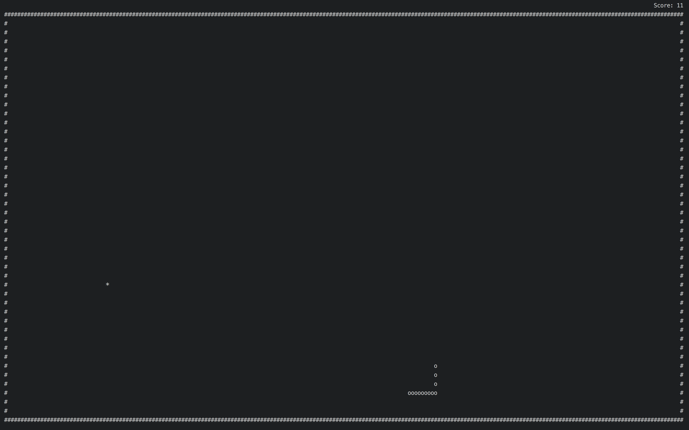

# c-snake
I wrote an ASCII version of snake in C using ncurses



## Building it
I used a makefile so you should be able to build it using 
```
$ make
```

Then you can run it using 
```
$ ./snake
```
